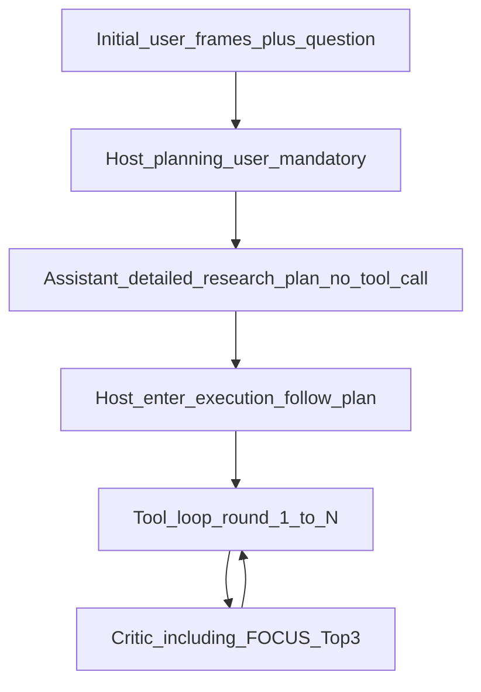

# rsagent-v2：强制 Research Plan、Critic 选帧与按规划探索

## 问题与目标

- **现象**（当前 [research_system_prompt.txt](file:///mnt/sda/Projects/video-deep-research/rsagent-v2/prompts/research_system_prompt.txt)）：仅靠「文中要求先分解再调用工具」仍易出现 **不调用 `focus_select_keyframes`、网页/视觉证据不足就无 `<tool_call>` 结束**。
- **目标架构**：**每个案例必须先产出一份详细的、可执行的 Research Plan**（固定结构，写入对话历史），**主循环中的工具调用应落实该计划**（逐步完成子步骤，而非自由发挥后早停）。
- **与「工具顺序」的关系**：不再依赖单一全局句式（例如「必须先 FOCUS 再搜索」或完全放开）；改为在 **Plan 中为每一步写明拟用工具**（`focus_select_keyframes` / `deep_research_web_search`）与 **完成判据**。若任务纯属站外知识且与画面无关，Plan 中须 **显式论证** 可跳过 FOCUS；**FOCUS 已启用时**，凡计划依赖「本视频细粒度画面」的步骤必须对应 FOCUS 调用（query 与计划一致）。

## 背景（代码现状）

- **循环**：[loop.py](file:///mnt/sda/Projects/video-deep-research/rsagent-v2/video_dr_agent/loop.py) 当前每轮直接 `research_client.complete`；无独立的「仅规划、无 tool_call」阶段。
- **Critic 与 FOCUS**：[critic_deep_research.py](file:///mnt/sda/Projects/video-deep-research/rsagent-v2/video_dr_agent/critic_deep_research.py) 对 FOCUS 仅技术成功/失败 + 原文 JSON；网页侧才有 Rank+Jina。
- **注入**：[loop.py](file:///mnt/sda/Projects/video-deep-research/rsagent-v2/video_dr_agent/loop.py) `_collect_focus_frame_paths` 可注入多帧；计划改为 Critic Top3 驱动注入（见下节）。
- **参考结构**：[success_prompt.txt](file:///mnt/sda/Projects/video-deep-research/rsagent-v2/prompts/success_prompt.txt) 的「分解 → 单步执行 → 积累 → 综合」可迁移到 **Plan 模板 + `<tool_call>`**，勿整文件当 system（文件头有误放 `"""`）。

---

## 1. 强制 Research Plan（架构核心）

### 1.1 `run_loop` 行为（默认开启，非「可选项」）

在 **进入** `for r in range(1, max_rounds + 1)` **之前**，对每个 run **固定插入**：

1. **Planning user**（Host）：要求基于首轮中的 **均匀概览帧 + 问题**，输出 **一份详细 Research Plan**。**禁止**在本回合输出任何 `<tool_call>`。
2. **`plan_text = research_client.complete(...)`** → `research.append_assistant(plan_text)`。
3. **Execution handoff user**（Host）：明确 **执行阶段** 开始；要求后续每轮：
   - 在正文（reasoning）中 **标明当前落实的是 Plan 中哪一步**（例如 Step 2 / 子问题 B）；
   - **严格按计划顺序调用工具**（允许在 Critic 反馈后 **修订后续步骤** 的表述，但若增加/删除关键证据步骤，须在下一轮 assistant 开头简短说明对 Plan 的修订，并继续执行）；
   - **在完成 Plan 中所有「证据收集」步骤且 Critic/网页/视觉侧一致前**，不得输出 **无 `<tool_call>`** 的终答。

4. **不计入** `max_rounds`（规划 + handoff 为额外 API 与消息；`max_rounds` 仍只约束「带工具的主循环」轮数）。
5. **落盘**：`run_dir/planning.json`（或等价）记录 `planning_user`、`assistant_plan`、`execution_handoff_user`。

### 1.2 调试开关

- 仅保留 **显式关闭** 用于消融/单测：`--no-planning-phase` / `RESEARCH_PLANNING_PHASE=0`（默认 **开启** 强制规划）。
- 可选 `RESEARCH_PLANNING_USER_PATH`：覆盖默认 Planning user 全文（UTF-8 文件）。

### 1.3 Plan 内容规范（写入 prompt 与可选 Host 模板）

Research Plan 须 **至少** 包含（可由 `research_system_prompt.txt` + Host planning user 双重约束）：

- **任务重述**与成功标准（何为一题「答完」）。
- **从均匀帧已观察到的结论**（可简短）与 **信息缺口**。
- **有序步骤表**：每步包含 **子问题**、**拟用工具**（`focus_select_keyframes` / `deep_research_web_search`）、**预期获得什么证据**、**与主问题的关系**。
- **FOCUS 已启用时**：任何依赖「本视频局部画面/小字/时间定位」的步骤 **必须在表中对应 `focus_select_keyframes`**，并给出 **BLIP 友好** 的 query 草案；若整题与画面无关，须在 Plan 中单列 **「跳过 FOCUS 的理由」**。
- **网页侧**：需站外核实的子问题须对应 **独立搜索步骤**（可多条），并写清 **检索关键词思路**。
- **收束前检查清单**：列出「哪些视觉断言已核对、哪些网页来源已覆盖」后才允许终答。

### 1.4 `research_system_prompt.txt` 改写方向

- 将全文组织为 **Phase A：Planning（无工具）** / **Phase B：Execution（仅 `<tool_call>` 推进计划）** / **Phase C：Final（无工具，仅当检查清单满足）**。
- 删除或弱化易引发「死板顺序」的孤立句式，改为 **「一切工具调用须可追溯到已写明的 Plan 步骤」**。
- 与 [loop.py](file:///mnt/sda/Projects/video-deep-research/rsagent-v2/video_dr_agent/loop.py) 的 `reject_round1_no_tools` 配合：执行阶段第 1 轮若仍无 `<tool_call>`，nudge 应提醒 **「从 Plan 第一步开始执行」**（可更新 `DEFAULT_ROUND1_NO_TOOLS_NUDGE` 文案）。

---

## 2. Critic：FOCUS 成功后按问题筛 3 帧并驱动注入

（与前一版设计一致，略述要点。）

- [critic_prompts.py](file:///mnt/sda/Projects/video-deep-research/rsagent-v2/video_dr_agent/critic_prompts.py)：扩展 `CRITIC_SYSTEM_PROMPT_DEEP`；新增 `CRITIC_USER_FOCUS_TOP3_TEMPLATE`（`research_question`、`focus_query`、`frames` 元数据表）。
- [critic_deep_research.py](file:///mnt/sda/Projects/video-deep-research/rsagent-v2/video_dr_agent/critic_deep_research.py)：FOCUS 技术成功后额外 `_chat` 解析 `top3` JSON；`DeepResearchCriticAgent` 维护本轮 `focus_inject_paths`；stub 不设。
- [loop.py](file:///mnt/sda/Projects/video-deep-research/rsagent-v2/video_dr_agent/loop.py)：注入路径优先 `focus_inject_paths`，失败回退 `_collect_focus_frame_paths`（如前 3 张）。

**说明**：Critic 仍为纯文本时，选帧基于 **研究问题 + FOCUS query + 时间/索引/路径表**；看图选帧需多模态 Critic（另项）。

---

## 3. `research_system_prompt_force_focus.txt`

- 与「强制 Plan」并存时：可保留为 **更激进** 的变体（例如 Plan 模板中强制至少一行 FOCUS）；或在注释中说明默认 **plan-first** 已覆盖大部分场景，force 文件仅特殊实验用。

---

## 4. 测试与回归

- Stub critic：验证强制规划后消息序与 `planning.json`。
- Deep critic：FOCUS 成功 → Top3 注入；执行阶段多轮工具与 Plan 引用（人工读 trace）。
- 关闭 `--no-planning-phase` 的回归对比（可选）。

---

## 5. 模型侧提示语语言（英文）

- **范围**：所有由 **本仓库/框架构造并送入模型** 的文本——包括但不限于：`research_system_prompt*.txt`、`prompts/` 下默认文件、[critic_prompts.py](file:///mnt/sda/Projects/video-deep-research/rsagent-v2/video_dr_agent/critic_prompts.py) 中 system 与 user 模板、[loop.py](file:///mnt/sda/Projects/video-deep-research/rsagent-v2/video_dr_agent/loop.py) 内固定 user（如 `DEFAULT_ROUND1_NO_TOOLS_NUDGE`、FOCUS 多模态注入说明）、规划阶段与 execution handoff 的 Host 文案、以及实现中新增的默认 planning 字符串——**一律使用英文**。
- **例外**：用户提供的 **任务/问题正文**（首轮 user 中的自然语言问题）**不强制翻译**，可保持用户语言；模型输出语言仍可按原 prompt 约定（例如与问题一致或由 system 指定）。
- **外部文件**：`RESEARCH_PLANNING_USER_PATH` 等由用户提供的覆盖文件若为非英文，责任在用户；仓库内置默认路径内容应为英文。
