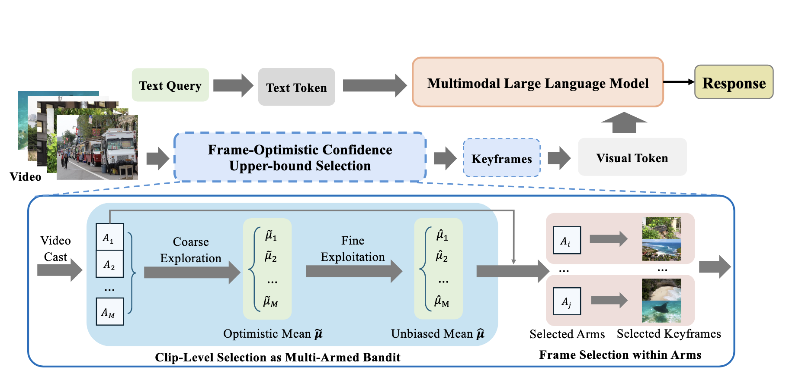

# FOCUS: Efficient Keyframe Selection for Long Video Understanding

> 🎉 **NEWS**: Our paper has been accepted by ICLR 2026! 
> 
> 📄 [Read the paper on OpenReview](https://openreview.net/forum?id=1OQKqLFcbB)



Multimodal large language models (MLLMs) represent images and video frames as visual tokens. Scaling from single images to hour-long videos, however, inflates the token budget far beyond practical limits. Popular pipelines therefore either uniformly subsample or apply keyframe selection with retrieval-style scoring using smaller vision-language models. However, these keyframe selection methods still rely on pre-filtering before selection to reduce the inference cost and can miss the most informative moments.

We propose **FOCUS**, *Frame-Optimistic Confidence Upper-bound Selection*, a training-free, model-agnostic keyframe selection module that selects query-relevant frames under a strict token budget. FOCUS formulates keyframe selection as a combinatorial pure-exploration (CPE) problem in multi-armed bandits: it treats short temporal clips as arms, and uses empirical means and Bernstein confidence radius to identify informative regions while preserving exploration of uncertain areas. The resulting two-stage exploration-exploitation procedure reduces from a sequential policy with theoretical guarantees, first identifying high-value temporal regions, then selecting top-scoring frames within each region.

On two long-video question-answering benchmarks, FOCUS delivers substantial accuracy improvements while processing less than 2% of video frames. For videos longer than 20 minutes, it achieves an 11.9% gain in accuracy on LongVideoBench, demonstrating its effectiveness as a keyframe selection method and providing a simple and general solution for scalable long-video understanding with MLLMs.


## Installation

1. First, follow the installation instructions from the [AKS repository](https://github.com/ncTimTang/AKS) to set up the environment and dependencies.

2. Then install the additional requirements:
```bash
pip install -r requirements.txt
```

### 复用已配置好的 AKS conda 环境（不新建环境）

在 `conda activate AKS` 之后执行（与 README 第 1 步的评测依赖共存）：

```bash
pip install -r requirements.txt scipy
pip install -e /path/to/SeViLA   # 提供 lavis，例如本机: pip install -e /mnt/sda/Datasets/SeViLA
```

SeViLA 会固定较旧的 `opencv-python-headless`，可能与环境中的 **numpy 2.x** 二进制不兼容。若出现 `numpy.core.multiarray failed to import`，在同一环境中升级 OpenCV  wheel 即可：

```bash
pip install --upgrade "opencv-python-headless>=4.10" "opencv-python>=4.10"
```

可选：用单条样本快速冒烟（需 GPU），见 `run_focus_aks_smoke.sh`。

## 这个仓库在做什么？

`select_keyframe.py` 是 **FOCUS 关键帧筛选**脚本：用 BLIP 图文匹配分数作相似度，在整段视频上按论文里的 bandit 策略选出 **固定数量**、与**当前文本查询**更相关的帧索引（输出 `selected_frames.json` 等）。  
默认从 LongVideoBench / VideoMME 的 JSON 里读「视频路径 + 问题」；也可用 **`--video_path` + `--query`** 对任意本地视频与自定义文本跑同一套流程。

**对时间是否敏感？** 算法本身是 **时序** 的：粗采样间隔 `coarse_every_sec`、细采样 `fine_every_sec`、帧间最小间隔 `min_gap_sec` 等都按**时间/帧序**工作。默认在**整段视频**上搜索。若只关心某一段，可设 **`--time_start_sec` / `--time_end_sec`**（半开区间 `[start, end)`，单位秒）：只在窗口内跑 FOCUS，但 `selected_frames.json` 里的索引仍是**原视频的全局帧号**。`sampling_details.json` 里会多一个 `time_window` 字段说明窗口与偏移。

## Usage

Run FOCUS keyframe extraction on LongVideoBench:

```bash
python select_keyframe.py \
    --dataset_name longvideobench \
    --dataset_path ./datasets/longvideobench \
    --output_dir focus_blip \
    --num_keyframes 64 \
    --batch_size 32 \
    --blip_model large
```

只先测 **1 条**（仍指向完整 `lvb_val.json`，只跑前几条里的子集）：

```bash
# 只跑标注里第 1 条（下标 0）
python select_keyframe.py --dataset_name longvideobench \
  --dataset_path /mnt/sda/Datasets/LongVideoBench --limit 1 ...

# 只跑第 42 条（0-based 下标 41）
python select_keyframe.py ... --offset 41 --limit 1
```

此时输出的 `selected_frames.json` 长度等于本次处理的条数：第 `i` 项对应原 `lvb_val.json` 里的第 `offset + i` 条。后续 `compare_focus_visualization.py` 里请用 `--video_index i`（在**本次子集**内从 0 数起，单条时恒为 `0`）。

### 自定义本地视频 + 文本（单条）

不依赖 `lvb_val.json`，直接指定文件路径与查询（BLIP 用该文本与每一帧算相似度）：

```bash
python select_keyframe.py \
  --video_path /path/to/your.mp4 \
  --query "你的问题或检索描述，例如：台上穿灰衣服的人在做什么？" \
  --output_dir my_run \
  --num_keyframes 32 \
  --batch_size 16 \
  --blip_model large
```

长文本可放入文件并用 `--query_file prompt.txt`。结果写在 `selected_frames/custom/<output_dir>/`（`selected_frames.json` 仅一项列表）。

只在 **30s～120s** 内选帧（输出仍是整段视频的帧号）：

```bash
python select_keyframe.py --video_path /path/to/your.mp4 --query "..." \
  --time_start_sec 30 --time_end_sec 120 --output_dir clip_run ...
```

导出帧/问题/视频到文件夹（custom）：

```bash
python compare_focus_visualization.py \
  --dataset_name custom \
  --custom_video /path/to/your.mp4 \
  --custom_question "同上查询" \
  --selected_frames ./selected_frames/custom/my_run/selected_frames.json \
  --output_dir ./visual_compare/my_run \
  --symlink_video
```

## Evaluation

For evaluation, please follow the evaluation setup from the [lmms-eval repository](https://github.com/EvolvingLMMs-Lab/lmms-eval) and use the evaluation scripts provided in the [AKS repository](https://github.com/ncTimTang/AKS).

## Output

FOCUS generates the following outputs:

- `selected_frames.json`: Selected keyframe indices for each video（与数据集样本顺序一致）
- `keyframes.json`: 与上同序，每条为 `{"frame_indices": [...], "times_sec": [...], "fps": ...}`，其中 `times_sec[i] = frame_indices[i] / fps`（按恒定 fps 由 decord 报告值换算；可变帧率视频仅作近似）
- `sampling_details.json`: Detailed sampling information including:
  - Coarse and fine sampling results
  - Arm information and FOCUS scores
  - Arm selection probabilities
  - Video metadata
- `extraction_stats.json`: Statistics about the extraction process

### 导出筛选帧、问题、原视频到子目录

将某条样本的 FOCUS 结果整理为三个文件夹（默认不生成 HTML）：

```bash
python compare_focus_visualization.py \
  --dataset_name longvideobench \
  --dataset_path ./datasets/longvideobench \
  --selected_frames ./selected_frames/longvideobench/focus_blip/selected_frames.json \
  --video_index 0 \
  --output_dir ./visual_compare/sample0 \
  --symlink_video
```

输出结构：

- `frames/`：选中帧图片（`--thumb_size 0` 为原分辨率）
- `question/question.txt`、`question/meta.json`（含 `selected_frame_indices`）
- `video/source.mp4`：需加 `--symlink_video` 或 `--copy_video` 才会写入

可选 `--html` 额外生成根目录下的 `comparison.html` 对比页。


## Citation

If you find FOCUS useful for your research, please cite our paper:

```bibtex
@inproceedings{
ziruiz2026focus,
title={{FOCUS}: Efficient Keyframe Selection for Long Video Understanding},
author={Zirui Zhu and Hailun Xu and Yang Luo and Yong Liu and Kanchan Sarkar and Zhenheng Yang and Yang You},
booktitle={The Fourteenth International Conference on Learning Representations},
year={2026},
url={https://openreview.net/forum?id=1OQKqLFcbB}
}
```

## Acknowledgments

This work builds upon the excellent research from:
- [AKS: Adaptive Keyframe Sampling](https://github.com/ncTimTang/AKS) for the evaluation framework
- [lmms-eval](https://github.com/EvolvingLMMs-Lab/lmms-eval) for multimodal evaluation

