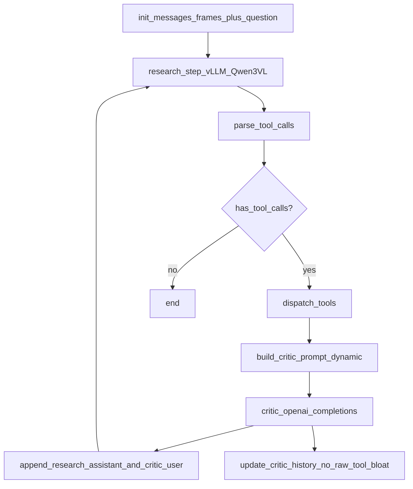

# Video DeepResearch Agent 框架（rsagent）

## 目标目录与结构

在 [`/mnt/sda/Projects/video-deep-research/rsagent`](/mnt/sda/Projects/video-deep-research/rsagent) 下新增子包（避免与现有 `test_prompt.py` 混成一团）：

- [`rsagent/video_dr_agent/__init__.py`](/mnt/sda/Projects/video-deep-research/rsagent/video_dr_agent/__init__.py) — 导出 `run_loop`、核心类型
- [`rsagent/video_dr_agent/parsing.py`](/mnt/sda/Projects/video-deep-research/rsagent/video_dr_agent/parsing.py) — **工具调用解析**（对齐 [dryrun_tool_loop.py](file:///mnt/sda/Datasets/Vision-DeepResearch/rllm/eval/dryrun_tool_loop.py) 的 `extract_tag_block` + [deepresearch_agent.py](file:///mnt/sda/Datasets/Vision-DeepResearch/rllm/vision_deepresearch_async_workflow/deepresearch_agent.py) 的 `json5.loads` 思路）
- [`rsagent/video_dr_agent/research_context.py`](/mnt/sda/Projects/video-deep-research/rsagent/video_dr_agent/research_context.py) — **Research 专用 `messages` 缓冲**（见下文「上下文隔离」；**禁止**写入原始工具输出）
- [`rsagent/video_dr_agent/critic_context.py`](/mnt/sda/Projects/video-deep-research/rsagent/video_dr_agent/critic_context.py) — **Critic 专用 `messages` 缓冲**（见下文；**不累积**历史轮次的工具执行结果长文本）
- [`rsagent/video_dr_agent/qwen3vl_client.py`](/mnt/sda/Projects/video-deep-research/rsagent/video_dr_agent/qwen3vl_client.py) — **Research = 本地 vLLM 上的 Qwen3-VL**（见下节「vLLM 调用约定」；实现上复用 [chat_qwen3vl_video.py](file:///mnt/sda/Datasets/Vision-DeepResearch/rllm/eval/chat_qwen3vl_video.py) 的 `_chat_create`、`image_url` / `video_url` 片段构造与 httpx 回退；**不**依赖 rllm/OpenAIEngine）
- [`rsagent/video_dr_agent/openai_critic.py`](/mnt/sda/Projects/video-deep-research/rsagent/video_dr_agent/openai_critic.py) — **Critic 的 OpenAI 兼容调用**（对齐 [rsagent/test_prompt.py](file:///mnt/sda/Projects/video-deep-research/rsagent/test_prompt.py)：`openai.chat.completions.create(model=..., messages=..., temperature=...)`；通过构造函数传入 `base_url` / `api_key` / `model`，**不**硬编码密钥；可选用 `OpenAI` 客户端或与 test_prompt 相同的全局配置风格二选一，**推荐**显式 `OpenAI(base_url=..., api_key=...)` 实例，避免污染全局）
- [`rsagent/video_dr_agent/protocols.py`](/mnt/sda/Projects/video-deep-research/rsagent/video_dr_agent/protocols.py) — **仅接口**：`ToolDispatcher`；**`CriticPromptBuilder`**（动态组装 **本轮** 发给 critic 的 user 文本，内含当轮 `tool_runs` 等）；**`CriticAgent`**（`complete(self, *, critic_messages: list) -> str` 或 `run_round(...)` — 由实现决定签名，但 **必须** 使用上述 OpenAI 风格 API；**对外返回** 写入 research 的 **唯一** user 反馈字符串）
- [`rsagent/video_dr_agent/loop.py`](/mnt/sda/Projects/video-deep-research/rsagent/video_dr_agent/loop.py) — **主循环 + 每轮保存**
- 可选入口：[`rsagent/run_video_dr_agent.py`](/mnt/sda/Projects/video-deep-research/rsagent/run_video_dr_agent.py) — 极简 argparse（`--frames`、`--question`、`--out-dir`），便于手动试跑

不在此阶段修改现有 `test_prompt.py` / `search_agent.py`（除非你后续要求接入）。

## Research 与本地 vLLM（Qwen3-VL）调用约定

- **部署假设**：你在本机或内网用 **vLLM** 拉起 **Qwen3-VL**，并启用其 **OpenAI 兼容 HTTP API**（通常为 `http://<host>:<port>/v1`，与 `chat_qwen3vl_video.py` 的 `--base-url` 一致）。
- **客户端**：使用 **OpenAI Python SDK** 的 `OpenAI(base_url=..., api_key=...)` 调 **`/chat/completions`**；若 SDK 对 `video_url` / 多图 `image_url` 校验失败，则 **同脚本** 用 **httpx 直 POST JSON** 回退 —— 这是对 **vLLM 服务端格式** 的兼容，而非再走 HuggingFace/transformers 本地推理。
- **请求体格式（vLLM 侧）**：`messages` 为 Chat Completions 结构；多模态 user 的 `content` 为 **parts 数组**，元素为 OpenAI 风格 **`{"type":"text","text":...}`**、**`{"type":"image_url","image_url":{"url":...}}`**（帧图用 base64 data URL 或 http 直链），若你改用整段视频则 **`{"type":"video_url","video_url":{"url":...}}`** —— 与 vLLM 文档及 `chat_qwen3vl_video.py` 一致。
- **配置入口**：`VLLMResearchConfig`（或等价参数组）：`base_url`、`api_key`（vLLM 常填占位即可）、`model`（与 `--served-model-name` 一致）、`max_tokens`、`temperature`；CLI 暴露 `--vllm-base-url`、`--vllm-model` 等。

**与 Critic 的区分**：Research **仅** 指向 **vLLM**；Critic 仍可为 **另一路** OpenAI 兼容网关（如 `test_prompt.py` 的代理），二者 **base_url/model 分离**。

## 工具调用协议（与现有 VDR 对齐）

- 从 assistant 文本中提取 **所有** `<tool_call>...</tool_call>` 块（循环内常见为单块；支持多块以便扩展），每块用 `json5` 解析为 `{"name": str, "arguments": dict}`（与 dryrun / deepresearch_agent 一致）。
- 若某块解析失败：记录到当轮 trace，该次调用生成错误字符串作为 tool result（与现有 agent 的 “Json Parse Error” 行为一致），不中断整轮（或可配置为 strict；默认宽松以便调试）。

**终止条件**：当轮解析得到的 **工具调用列表为空**（即模型输出中无合法 `<tool_call>`）时结束循环；另设 `max_rounds` 防止死循环。

## 双通道上下文隔离（防污染）

### Research agent（经 vLLM 的 Qwen3-VL）

送入 **`qwen3vl_client` → vLLM `chat.completions`** 的 **`research_messages` 仅允许包含**：

1. **Prompt**：初始化时的 **system**（可选占位）+ **首条 user**（多模态帧 + 任务/问题文本）；不在后续轮次重复塞入完整工具协议长文（除非你选择在首条 user 固定说明，算「prompt」一部分）。
2. **Research 自己之前生成的内容**：每一轮模型返回的 **assistant** 全文（含 `<tool_call>` 等），按时间顺序追加。
3. **Critic 返回的结果**：每一轮在工具路径结束后，**仅**将 **`CriticAgent` 产出的 distilled `feedback` 字符串** 作为下一条 **user** 追加。

**明确禁止** 写入 `research_messages` 的内容（避免上下文被工具原始输出、中间观测刷屏污染）：

- `ToolDispatcher` 的 **原始返回字符串**、`<tool_response>...</tool_response>` 原文、未经过 critic 的 **完整 `tool_runs` JSON/拼接块**；
- Critic 侧 **内部** 推理过程（除非你愿意把其中一部分复制进 `feedback`，那是 critic 输出，不是 raw tool）。

效果：research 线程里 **user 侧只有「首轮任务」+「critic 反馈」**，assistant 侧只有 **research 模型自己的历史**；与 [test_prompt.py](file:///mnt/sda/Projects/video-deep-research/rsagent/test_prompt.py) 中「工具结果以 user 再喂回」形似，但此处 **user 只接 critic**，不接 raw tool。

### Critic agent（OpenAI 兼容 API）

维护 **独立** 的 **`critic_messages`**，与 `research_messages` **绝不共享同一列表引用**。调用方式对齐 [test_prompt.py](file:///mnt/sda/Projects/video-deep-research/rsagent/test_prompt.py) 中的：

`openai.chat.completions.create(model=..., messages=messages, temperature=...)`（实现时用显式客户端 + 配置入参，避免照抄脚本里的密钥）。

**`critic_messages` 中应保留的内容**：

- **Critic 的 prompt**：通常是一条 **system**（占位）定义 critic 角色与格式要求；
- **Critic 自己之前生成的内容**：各轮 **assistant** 回复（推理、对 research 的评价、若 critic 也需结构化输出等）；
- **「工具调用行为」**：指 **critic 文本里描述的调用意图 / 已解析出的调用指令**（或等价短摘要），**不**把环境与 research 混写进 research 线程即可；若 critic 未来支持 function calling，则 **assistant 侧的 tool_calls / 模型决定** 保留在 critic 历史。

**不应跨轮累积进 `critic_messages` 的内容**：

- **工具执行结果的长文本**（搜索引擎全文、解释器 stdout 等）：**仅允许**出现在 **本轮临时构造的** `user` 消息里（由 `CriticPromptBuilder` 一次性注入，供当次 `completions.create` 使用）；**调用结束后**从「长期 history」策略上 **不保留** 该大段结果（例如：每轮 API 请求体 = `[system] + 可选短历史 assistant + [user=builder 本轮全文]`，其中本轮全文含工具输出；**下一轮** 不再把上一轮的完整工具输出作为独立 message 留在列表里，只保留 critic 的 assistant 摘要）。占位实现可用「每轮仅 system + 单条 user + 取回复后只 append assistant」达到同样效果。

**对外契约不变**：`CriticAgent` 仍返回 **一段字符串 `feedback`**，由主循环 **仅** 追加到 `research_messages` 的 **user**。

## 主循环数据流（research → 工具 → 动态 prompt → critic 一步回传）

将原先的 summarize 与 critic **合并为一条链路**：先由 **`CriticPromptBuilder`** 根据当轮信息 **动态组装** 本轮 critic 的 **user 载荷**（内含当轮 `tool_runs` 等）；再交给 **`CriticAgent`** 用 **OpenAI 兼容** `chat.completions` 基于 **`critic_messages`** 完成当轮推理；**返回值 `feedback`** 即给 research 的 **唯一** 工具侧反馈。主循环 **不再** 单独调用 `summarize`，且 **不把** raw tool 写入 `research_messages`。

- **Research**：`research_messages -> vLLM OpenAI chat.completions`（`qwen3vl_client`），返回 `assistant_text`；**仅** `research_messages.append(assistant)`。
- **工具**：对每条解析结果调用 `ToolDispatcher.dispatch(...)`（**不** append 到 `research_messages`），收集为 `tool_runs`。
- **Critic 链路（合并后 + OpenAI API）**：
  - `user_payload = builder.build(round_index=..., research_assistant_text=..., tool_runs=..., ...)`。
  - 将 `user_payload` **按策略** 并入 `critic_messages`（占位实现：**本轮请求** 使用 `system + user_payload`，得到 `assistant` 后 **只** 将 **critic 的 assistant** 追加到持久 `critic_messages`，**不** 把大段工具输出留在跨轮 history；详见上文）。
  - `feedback = completion.choices[0].message.content`（与 test_prompt 一致字段路径）。
- **写回 research**：**仅** `research_messages.append({"role":"user","content": feedback})`。VDR 式 `<tool_response>` 若需要，只应出现在 **`feedback` 文本内部**（由 critic 或 builder 决定），而不是另起一条 raw tool user。

## 每轮保存

- 入参 `run_dir: Path`；每轮写入 `run_dir / f"round_{i:04d}.json"`（或 `trace.jsonl` 追加一条），内容包含：`round`、`research_assistant_raw`、`parsed_tool_calls`、`tool_runs`（完整原始输出，**仅存盘，不进 research 上下文**）、**`critic_user_payload`（builder 输出）**、**`critic_assistant`（API 返回）**、**`research_feedback`（= 写入 `research_messages` 的 user，通常与 `critic_assistant` 一致）**、`research_messages_redacted`、`critic_messages_redacted`（可选截断 base64/长工具段）。

## 与参考文件的分工

| 参考 | 本框架取用 |
|------|------------|
| [chat_qwen3vl_video.py](file:///mnt/sda/Datasets/Vision-DeepResearch/rllm/eval/chat_qwen3vl_video.py) | **与本地 vLLM 对话的官方路径**：`base_url` 指向 vLLM `/v1`；`chat.completions` + httpx 回退；多模态 parts（`image_url` / `video_url`）即 vLLM 所期望格式 |
| [vdr_model_probe.py](file:///mnt/sda/Datasets/Vision-DeepResearch/rllm/eval/vdr_model_probe.py) | 仅借鉴「首条多模态 user 构造」思路；不引入 `OpenAIEngine`/parquet |
| [dryrun_tool_loop.py](file:///mnt/sda/Datasets/Vision-DeepResearch/rllm/eval/dryrun_tool_loop.py) | `extract_tag_block`、round 循环结构、assistant 先入库再注入 observation |
| [rsagent/test_prompt.py](file:///mnt/sda/Projects/video-deep-research/rsagent/test_prompt.py) | **Critic**：`openai.chat.completions.create` + `messages`；Research 侧 **不** 照搬其「raw 工具结果直接 user 追加」——仅采纳「多轮交替」形态，**user 内容来源改为 critic 输出** |

## 依赖

- `openai`（Research 调 vLLM、Critic 调网关）；可选 `httpx`（vLLM 多模态字段 SDK 校验失败时回退，与 `chat_qwen3vl_video.py` 一致）。
- **运行环境**：需已单独启动 **vLLM** 服务并加载 Qwen3-VL（服务端需支持视频/多图时按 vLLM 文档安装相应 extra，如 `vllm[video]`）；框架内不启动 vLLM。
- `json5`（与 VDR 一致，用于宽松 JSON 解析）。若你希望零额外依赖，可改为标准 `json` 并注明与 VDR 差异；**建议保留 json5** 以与现有 probe/agent 行为一致。

## 明确不实现（仅接口/占位）

- Research / Critic 的 system、user 具体文案、工具名 schema、`CriticPromptBuilder` 模板细节。
- **实现** `OpenAICriticAgent` 时仅接好 **API 形态**（model/base_url/api_key/temperature/messages），**不** 在仓库中写入真实密钥。
- 视频抽帧：仅接受 **帧路径列表** 或 **已构造好的 image parts**；抽帧函数留 `Protocol` / `raise NotImplementedError` 或 CLI 要求用户传入多张图路径。
